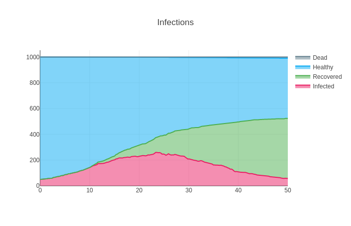
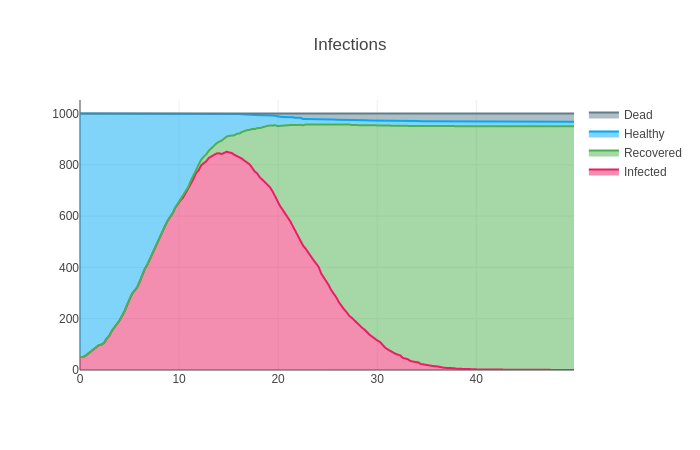

# Haar Wavelets

The first component of this study, was working with haar wavelets, and using
those for signal compression. Haar wavelets are a specific wavelet that is used
primarily for signal compression and transmission. In fact haar wavelets are the
basis of almost all streaming systems, including audio and video streaming.
Researching through the mathematics of the Haar wavelets, we constructed the
origin of the wavelet from the original transition function, and determined the
validity of the iterative algorithm that is commonly used to construct the haar
coefficients.

An important aspect of the haar wavelet is that it is temporally independent,
so with the fourier transform, each new term has an effect everywhere along the
reconstruction of the signal, but by using the haar wavelet, every additional
term only effects a small portion of the signal.

As a consequence of the construction of the haar coefficients, the highest
order details, have a lower index in the haar coefficients, and higher detail
components of the signal are mapped to higher index coefficients. This is why
the Haar coefficients are great for data transfer. Because if some data is lost,
that will likely be from the end of the data stream, and in the case of the haar
wavelets, these coefficients only provide the highest level of detail and can
easily be removed without a noticeable decrease in signal quality.

## One Dimensional

Once an underlying understanding for the mathematics of haar signal transform,
and the algorithm that is used to implement it, we then implemented a sample
program in python which demonstrated the haar wavelet transform for different
signals. This python program allows users to play with the cutoffs for the
signal, both by the magnitude of the coefficient, and by their location in the
data. This means that it is possible to simulate a signal that is prematurely
cutoff, by limiting the coefficients to only the first half.

{height=500px}

This snippet of python code is a very basic implementation of the haar
transform, which takes a signal, formatted as a vector, and constructs the haar
coefficients for that signal.

```python
def haar(signal):
    n = np.log2(signal.shape[0])
    coef = deepcopy(signal)
    for j in np.arange(int(n - 1), 0 - 1, -1):
        coef_next = deepcopy(coef)
        for i in np.arange(0, int(2**j)):
            coef_next[i] = (coef[2 * i] + coef[2 * i + 1]) / 2.0
            coef_next[2**j + i] = (coef[2 * i] - coef[2 * i + 1]) / 2.0
        coef = deepcopy(coef_next)
    return coef
```

This one dimensional haar transform is how most audio streaming systems work,
where the transform the signal into the haar coefficients, and then those
coefficients are transmitted, where the receiver or user then reconstructs the
signal from the data they quarter received. And the very nice part about it is
that if any part of the signal is lost, so some of the coefficients are not
received, then it is still possible to reconstruct the original signal with a
high degree of accuracy.

## Two Dimensional

This one dimensional example is great for simple signals, but the haar
transform can actually be applied to any dimensional data. The process to do
this is by simply applying the haar transform on one axis first (lets say the x
axis), then we get an array of coefficients. Then we apply the haar transform in
the other axis. This process is infinitely extendable, by just applying the
transform in each axis one after another.

And again to implement this, we developed a python script which provided the
same options as the one dimensional version.

{height=500px}

This two dimensional algorithm is more similar to what is used for video
streaming, but video streaming also implements some more trickery with the
temporal similarities of the video.

# X-Ray Tomography

The next part of the project was x-ray tomography. Tomography is the process of
attempting to reconstruct the density function for some object from the
integral of the density along a ray. This is exactly what x-rays are doing, as
they are able to determine the percentage of the x-rays that are absorbed by the
body, and from their they attempt to reconstruct the original density function.
This is a very tricky problem, and is under constant development.

We worked on a very simplified example, where each "x-ray" is a perfect line
that passes through the density function. In reality it is practically
impossible to project an x-ray in a line, not all the photons will be traveling
parallel, so in reality x-ray tomography usually uses fan, or cone ray
tomography.

{width=250px}

The general concept of tomography, starting with a plate that projects parallel
rays through some density function, then for each ray we determine the sum of
the density function along this ray. Then we slightly rotate the plate, and
repeated the process. The data received from this scan is called a spirograph,
where the x axis is mapped to the rays on the plate, and the y axis is the
angle that the plate has been rotated through.

{width=250px}

Once the sinograph is constructed, then backprojection is done to reconstruct
the approximate density function. Backprojection is relatively simple, it is
simply taking an array of zeros, and re-projecting the x-rays that were used to
construct the sinograph, each cell of the array that those x-rays pass through,
add the value of that x-ray from the sinograph to that cell. This will produce
a density function which is much larger than desired, so it needs to be scaled.
After this is done, we can get a reasonably accurate result from the
backprojection.

{width=250px}

Notice that there is a lot of noise in the backprojection, and it is relatively
blurb. This is commonly fixed through either filtered backprojection, or by
using a more sophisticated reconstruction algorithm. However, these more
advanced algorithms were outside of the scope of this project. Attempting the
filtering by using the haar wavelet algorithms that we have previously
developed on the sinograph, did not give results of a desireable quality, and
usually made the backprojection more blurb. Nominally the filtering is done to
the fourier transform of the sinograph, so using haar wavelets should be
viable, but our construction of the filtering methods clearly do not align
with the methods used by the fourier algorithms.

# Virus Simulation

The final project was to construct a program that could simulate virus
transmission, and infection rates. The working result is available at
https://ardenrasmussen.github.io/virus-sim/.  The general concepts for this
project, was to simulate a simple simulation with a number of variables that
could be adjusted to visualize different results.

* Population
* Initial infected
* Percent social distancing
* Movement speed range
* Days to recovery range
* Radius of infection
* Mortality

In addition to these variables, the simulation provides the ability to draw in
the simulation region, to simulation quarantines.

Using this simulation, we can easily simulate the effects of social distancing.
In a simulation with 90% of the population social distancing, and only 5% of
the population initially infected, we can run the simulation and find the
results to be a maximum number of infected to be 259 people. This result is
shown in Figure 6.

{width=500px}

However if only half the population practiced social
distancing, then the maximum number of infected spikes to 851. This result is
shown in Figure 7. With these results it is clear that the number of people
social distancing is vital, and can make serious differences.

{width=500px}

Finally the structure of this simulation is such that new features can easily
be added on as desired. However, I left it in this base format, for more
customizability in the future.
